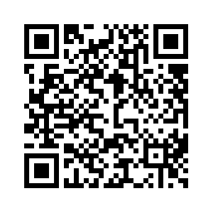

# Lecture: General Physics II
* Time: (2023 February 13 - May 31) 234節, Wednesday
* Lecturer: [Hauyu Baobab Liu](https://baobabyoo.github.io/) (呂浩宇)
* Location: NSYSU, 理 SC2001
* Language: 中文

### TA
- 葉晧祥 (j93939343@yahoo.com.tw)

### Office Hours (理SC2006-3)
- Location: **理SC2006-3**
- Time periods: Tue. 11:30-13:30; Wed. 12:30-14:30

### Homework and Suggested Problem Sets:
#### Homework (format: hand-writing on A4 papers; on due date, hand it to the TA)
- Halliday & Resnick's Principles of Physics (11th ed.),, chapter 37, Problems 1, 7, 13, 21 (due March 08)
- Halliday & Resnick's Principles of Physics (11th ed.),, chapter 38, Problems 23; Chapter 39, Problems 3, 9; Chapter 40, Problems 17, 54, 57  (due Apr. 12)

#### Suggestion
- Halliday & Resnick's Principles of Physics (11th ed.), chapter 37, Problems 6, 32, 37, 38, 39, 55
- Halliday & Resnick's Principles of Physics (11th ed.), chapter 38, Problems 1, 2, 5, 9, 11, 13, 56
- Halliday & Resnick's Principles of Physics (11th ed.), chapter 39, Problems 2, 4, 7, 12, 22, 25, 32, 35, 54, 55

## Syllabus:
1. (February 15) 狹義相對論 special relativity [PDF notes](https://github.com/baobabyoo/Lecture_GeneralPhysics_2023Feb/blob/master/lecture_notes/SpecialRelativity_part1.pdf)
2. (February 22) 狹義相對論現象 special relativity related phenomena [PDF notes](https://github.com/baobabyoo/Lecture_GeneralPhysics_2023Feb/blob/master/lecture_notes/SpecialRelativity_part2.pdf)
3. (March 01) 量子物理概念 general concept of quantum physics [PDF notes](https://github.com/baobabyoo/Lecture_GeneralPhysics_2023Feb/blob/master/lecture_notes/QuantumPhysics_part1.pdf)
4. (March 08) 自由電子波函數, 位能井 wave function of free electron, potential well
5. (March 15) 校慶放假
6. (March 22) 氫原子模型, 元素週期表 periodic table [PDF notes](https://github.com/baobabyoo/Lecture_GeneralPhysics_2023Feb/blob/master/lecture_notes/QuantumPhysics_part2.pdf)
7. (March 29) 固態物理簡介 introduction to solid state physics [PDF notes](https://github.com/baobabyoo/Lecture_GeneralPhysics_2023Feb/blob/master/lecture_notes/QuantumPhysics_part3.pdf) In addition, I came across [this webpage](https://www.pveducation.org/pvcdrom/pn-junctions/bias-of-pn-junctions) which gives a very nice introduction about the pn junctions.
8. (April 05) 清明節放假
9. (April 12) 期中考
10. (April 19) 靜電靜磁學 electric field/force, magnetic field/force [PDF notes](https://github.com/baobabyoo/Lecture_GeneralPhysics_2023Feb/blob/master/lecture_notes/Electromagnetic_part1.pdf)
11. (April 26) 電生磁、磁生電 law of induction [PDF notes](https://github.com/baobabyoo/Lecture_GeneralPhysics_2023Feb/blob/master/lecture_notes/Electromagnetic_part2.pdf)
12. (May 03) 基礎電路學 basic circuits [PDF notes](https://github.com/baobabyoo/Lecture_GeneralPhysics_2023Feb/blob/master/lecture_notes/Electromagnetic_part3.pdf)
13. (May 10) 馬克士威方程、電磁波 Maxwell's equation, electromagnetic wave [PDF notes](https://github.com/baobabyoo/Lecture_GeneralPhysics_2023Feb/blob/master/lecture_notes/Electromagnetic_part4.pdf)
14. (May 17) 物理光學 physical optics [PDF notes](https://github.com/baobabyoo/Lecture_GeneralPhysics_2023Feb/blob/master/lecture_notes/Optics_part1.pdf)
15. (May 24) 幾何光學 geometric optics [PDF notes](https://github.com/baobabyoo/Lecture_GeneralPhysics_2023Feb/blob/master/lecture_notes/Optics_part2.pdf)
16. (May 31) 原子核物理簡介 introduction to nuclear physics

## Goal:
1. Knowing modern physics, in particular, quantum physics.
2. Knowing the theory of atoms and how to build periodic table.
3. Broadly knowing the physical physical phenomena.

## Expectation:
1. This is a 3-credits' course. The expected weekly workload for you is 3 hours on average if you have no experience and knowledge in this area.
2. There is no final exams. The workload for you to produce your final report may be 10~15 hours if you have no experience and knowledge in this area.

## Assessment:
- homework: 10%
- mid-term: 25%
- final report: 65%

## Suggested Textbooks:
1. Jearl Walker, David Halliday, Robert Resnick, Principles of Physics >10th Edition.
